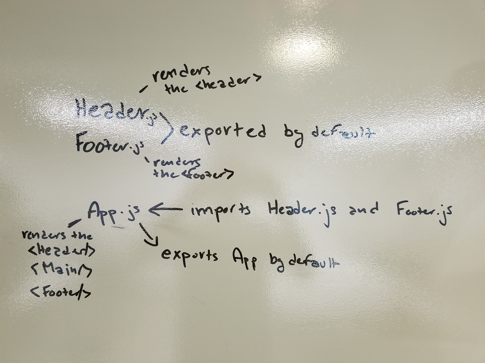

#  LAB

## Project Name

### Author: Student/Group Name

### Links and Resources

- [CodeSandbox](https://codesandbox.io/s/4lwoxzp66w)
- [travis](http://xyz.com)
- [back-end](http://xyz.com)
- [front-end](https://codesandbox.io/s/4lwoxzp66w)

### Modules

#### `app.js`

#### `header.js`

#### `footer.js`

#### `index.js`

##### Exported Values and Methods

header.js exports a class that has a render method inside of it.
footer.js exports a class that has a render method inside of it.
app.js imports the header.js and footer.js files and renders both
of the files along with the Main class then exports a class of App
that has the render method inside of it.

#### Flow of Modules

### Setup

#### `.env` requirements

- `PORT` - Port Number
- `MONGODB_URI` - URL to the running mongo instance/db

#### Running the app

- `npm start`
- Endpoint: `/foo/bar/`
  - Returns a JSON object with abc in it.
- Endpoint: `/bing/zing/`
  - Returns a JSON object with xyz in it.
